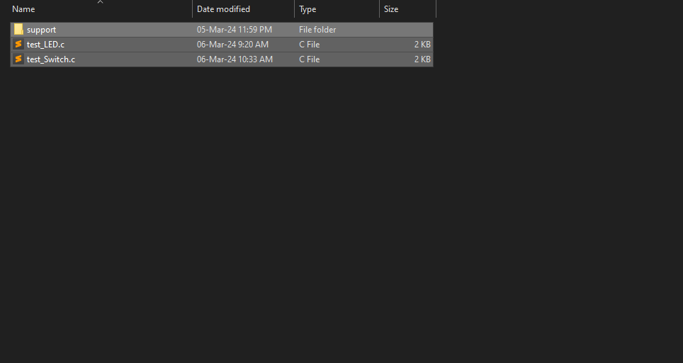
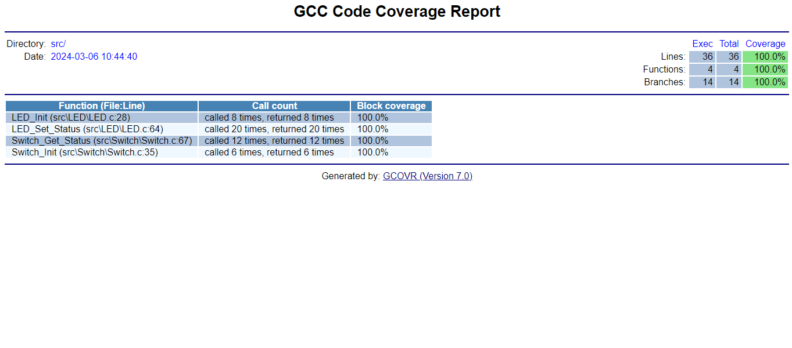
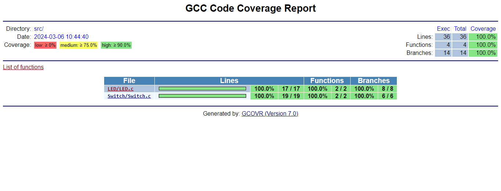

# **ARM-stm32f401-CortexM4 Test Workspace**

- ## Test Cases Scenario

  You Can Find All Test Cases Scenario from this path ***test/*** or [Click here](./test/) to go to the test folder.
  
  

* ## Code Coverage Report

  You Can Find All Code Coverage Report from this path ***build/artifacts/gcov*** or [Click here](./build/artifacts/gcov/) to go to the Code Coverage folder.

  * For GCC Code Coverage Report For Functions [Click here](./build/artifacts/gcov/GcovCoverageResults.functions.html)

    

  * For GCC Code Coverage Report [Click here](./build/artifacts/gcov/GcovCoverageResults.html)

    
    
    